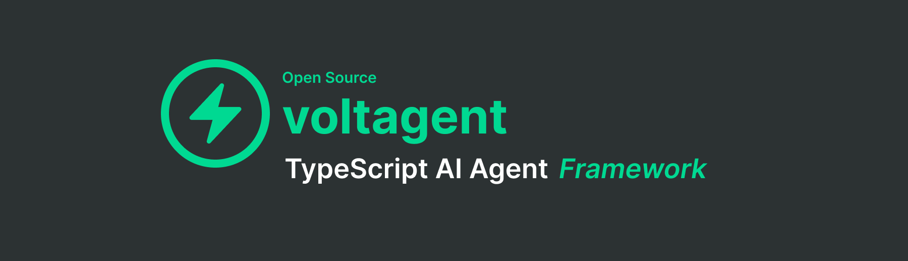

## The Black Box is Open: Meet VoltAgent

Building with AI often feels like working with a black box, a challenge common across many programming ecosystems. Recognizing this, and seeing the specific needs within the JavaScript/TypeScript world where tooling hasn't kept pace with Python's maturity, we built VoltAgent. JS/TS developers deserve a framework that brings structure, clarity, and a first-class developer experience to AI agent development.

We felt this pain too. As developers who previously built and scaled open-source projects like Refine, we saw the power of community and the need for better tooling. That's why we built VoltAgent.

**Today, we're thrilled to announce the first release of VoltAgent!**

VoltAgent is more than just another library; it's a comprehensive framework designed from the ground up to **simplify the creation, debugging, and deployment of AI agents in JavaScript and TypeScript.**

## What is VoltAgent?

Drawing inspiration from the clarity of No-Code tools but retaining the power and flexibility developers demand, VoltAgent provides:

- **A Core Framework (`@voltagent/core`):** Robust foundations for defining agent logic, managing state, and orchestrating complex workflows.
- **Exceptional Observability:** Forget `console.log` debugging. VoltAgent offers built-in tools (check our [Observability](/docs/observability/overview) docs!) to visualize agent execution, inspect state changes, and trace requests, drastically reducing debugging time from hours to minutes.
- **Seamless Integration (`@voltagent/vercel-ai`, etc.):** Easily connect with popular AI providers and platforms (explore the [providers](/docs/agents/providers/) docs).
- **Command-Line Interface (`@voltagent/cli`):** Get up and running quickly with project scaffolding and management tools via `create-voltagent-app`.
- **Extensibility:** Designed with modularity in mind, allowing for custom tools, providers, and integrations (like potential voice capabilities hinted at in `@voltagent/voice`).
- **Clear Best Practices:** We provide guidance and structure (see `agents` and `utils` docs) to help you build maintainable and scalable AI applications.

## Beyond Logs: Meet the VoltAgent Developer Console

[](https://console.voltagent.dev/)

Debugging AI agents often involves sifting through endless `console.log` statements or trying to piece together scattered information across different services. This "black box" debugging is slow, frustrating, and hinders rapid iteration.

VoltAgent changes the game with its integrated **[Developer Console](https://console.voltagent.dev/)**. Think of it as a visual control center specifically designed for your AI agents:

- **Visualize Execution Flow:** See exactly how your agent processes information, which functions are called, which tools are used, and where decisions are made – all laid out visually in a clear graph.
- **Inspect State & Data in Real-Time:** No more guessing. Examine the agent's internal state, inputs, outputs, and tool interactions at any point during its execution. Understand exactly what data it's working with.
- **Step-Through Tracing & Timings:** Dive deep into specific runs, tracing requests and responses step-by-step to pinpoint issues quickly, and analyze the performance of each step.

This visual-first approach to observability isn't just a nice-to-have; it fundamentally improves the developer experience. It makes debugging intuitive, transforms hours of guesswork into minutes of clarity, and dramatically accelerates development cycles. This is a core part of how VoltAgent empowers you to build robust AI applications with confidence.

## Why VoltAgent?

As outlined in our [Manifesto](/about), VoltAgent was born from our own experiences. We wanted the flexibility of code combined with the insightful visualization often found in visual tools, but without the lock-in. We believe the JavaScript ecosystem deserves dedicated, powerful AI tooling.

VoltAgent is our answer – a tool built _by_ JS developers, _for_ JS developers, aiming to make AI development less daunting and more productive.

## Get Started in Minutes

Ready to ditch the black box? You can start building your first agent right now:

```bash
npm create voltagent-app@latest my-first-agent
cd my-first-agent
npm run dev # or yarn dev / pnpm dev
```

Dive into our **[Getting Started Guide](/docs/)** for a deeper look.

## Join the Community

VoltAgent is just beginning, and we're building it in the open. We believe in the power of community (check the `community` docs folder for ways to connect!).

- **Report Bugs & Request Features:** [GitHub Issues](https://github.com/VoltAgent/voltagent/issues)
- **Ask Questions & Share Ideas:** [Discord](http://s.voltagent.dev/discord)
- **Contribute:** [Contribution Guide](/docs/community/contributing)

We're incredibly excited to see what you build with VoltAgent. Let's redefine AI development for JavaScript together!

---

The VoltAgent Team
