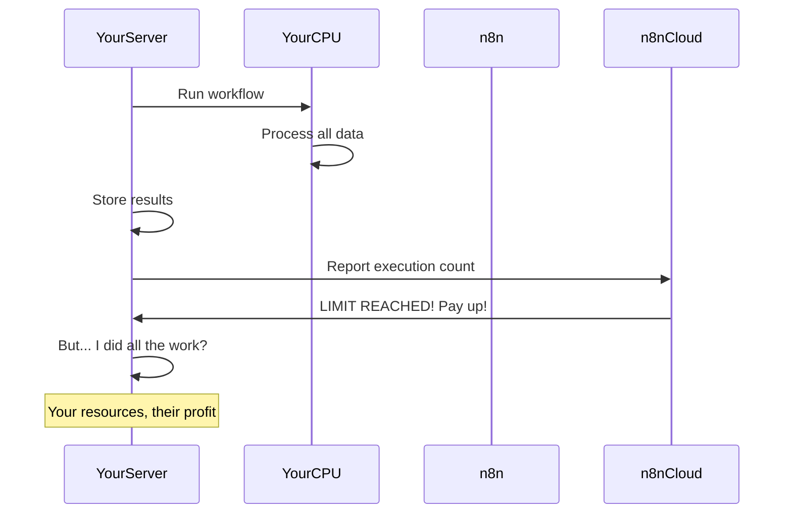

# n8n's New Pricing Model and the Vendor Lock-in Problem

Something weird is happening in the workflow automation world. n8n used to be the cool open-source alternative to Zapier and Make. You know, the one where you could actually run it on your own servers without paying per task. Well, that's not really true anymore.

## What Happened to the Open Source Promise?

Remember why we all got excited about n8n in the first place? It was supposed to be different. You download it, run it on your server, and boom: unlimited workflows without someone counting every single automation you run. No more "you've hit your zap limit" emails.

But here's the thing: they just changed the rules.

Now, even if you're running n8n on your own server (yes, YOUR server that YOU pay for), you still have execution limits. Let that sink in. You're using your own CPU, your own RAM, your own bandwidth, and somehow you still need to pay n8n when you run too many workflows.

## The Pricing That Doesn't Make Sense

Go check out n8n's pricing page. I'll wait.

Notice anything weird? They have this "Business Plan" where you have to self-host the software AND you get execution limits. That's like buying a printer and then having to pay HP every time you print more than 100 pages a month, except you're also buying your own paper and ink.

Here's the pricing structure (you'll need to dig deep to find all the details):

| Plan              | Hosting Type | Execution Limits       | The Real Problem                                                |
| ----------------- | ------------ | ---------------------- | --------------------------------------------------------------- |
| **Community**     | Self-hosted  | Supposedly unlimited\* | \*Hidden on the pricing page, hard to find clear info           |
| **Cloud Starter** | n8n Cloud    | Limited executions     | Pay per workflow run on their infrastructure                    |
| **Cloud Pro**     | n8n Cloud    | More executions        | Still counting every automation                                 |
| **Business**      | Self-hosted  | WITH LIMITS            | You host it, you pay for servers, but still have execution caps |
| **Enterprise**    | Both options | Negotiable             | "Let's discuss your budget" territory                           |

The Business plan is the real kicker. You're self-hosting (using YOUR infrastructure) but still getting execution limits unless you pay more. How does that make any sense?

Here's what bugs me most:

**It's not really self-hosted if there are limits**. The whole point of self-hosting is that you control everything. If I want to run a workflow a million times, and my server can handle it, why should anyone else care?

**The community edition is basically hidden**. Try finding clear info about truly free self-hosting options. Good luck. The pricing page pushes you toward paid plans while keeping the free options vague.

**Everything counts as an execution**. Got a simple workflow that checks your email every 30 minutes? That's 1,440 executions per month just for that one task. Add a few more basic automations and suddenly you're looking at paid tiers.

## Why This is Actually Insane

Let me break down what happens when you run a workflow on YOUR self-hosted n8n:

1. Your server's CPU does all the work
2. Your RAM handles the data
3. Your hard drive stores everything
4. Your internet connection makes all the API calls
5. You pay the electricity bill

But somehow n8n wants a cut? That's like Toyota charging you per mile on a car you bought and paid for. With your own gas. On roads you pay taxes for.

Here's the visualized:




## Let's Do Some Quick Math

Here's what real usage looks like:

**Basic Email Setup**: You want to sort emails from 3 accounts:

- Check every 30 minutes = 48 times a day per account
- 3 accounts × 48 × 30 days = 4,320 executions monthly
- Congrats, you might already need a paid plan for this basic task

**Small Online Store**: Syncing orders and sending updates:

- Processing 100 orders daily = 3,000 executions
- Inventory checks every hour = 720 executions
- Customer emails (200/day) = 6,000 executions
- Total: almost 10,000 executions per month

These aren't complex setups. This is basic stuff that any small business needs. But with execution limits, every efficiency improvement costs you money.

## The Lock-in Trap

Here's the really sneaky part. Once you've built a bunch of workflows in n8n, you're stuck:


**Your workflows only work in n8n**. All those nodes and connections you carefully set up? They don't translate to other platforms. Moving means starting from scratch.

**Your data is trapped**. Months or years of execution history, logs, and configs are all in n8n's format. Good luck getting that out in a useful way.

**Your team knows n8n**. You've spent time learning how it works, finding workarounds for its quirks, building internal docs. That knowledge is worthless elsewhere.

**It feels too expensive to leave**. This is the killer. After a while, paying the monthly fee seems easier than rebuilding everything. They're counting on this.

## There's a Better Way: VoltAgent

This is exactly why we built VoltAgent differently. It's not a platform, it's a framework. You write code, you own it, you run it however you want:

```typescript
// With VoltAgent: this is YOUR code on YOUR server
import { createAgent, workflow } from "voltagent";

const emailChecker = createAgent({
  name: "EmailChecker",
  async execute(context) {
    // Check emails, process them, whatever you want
    const emails = await getEmails();
    return processEmails(emails);
  },
});

// Run this every 30 minutes, forever, for free
const automation = workflow().addAgent(emailChecker).schedule("*/30 * * * *"); // No execution counting BS
```

Why this is better:

- **Actually unlimited**: Run it a billion times if you want
- **It's just code**: Store it in Git, review it, modify it
- **Works anywhere**: It's TypeScript - run it on any server
- **No vendor lock-in**: Your automations aren't trapped in someone else's system

GitHub repo: https://github.com/VoltAgent/voltagent  
Tutorial: https://voltagent.dev/tutorial/introduction/  
VoltOps demo: https://console.voltagent.dev/demo

## What Should You Do If You're Using n8n?

Don't panic, but start planning:

### Right Now

1. **Check your execution count**: See how screwed you actually are
2. **Document everything**: Screenshot your workflows before you need them
3. **Figure out what's critical**: Which automations would hurt most if they stopped?

### Your Options

**If you need something simple**:

- Make.com: At least their pricing is upfront
- Zapier: Expensive but reliable
- IFTTT: Super limited but might work for basics

**If you need real power**:

- Apache Airflow: Actually open source, but more complex
- Temporal: Great for complex workflows, truly unlimited
- VoltAgent: Build it yourself, own it forever

### Or Just Build Your Own

Honestly? With AI helping these days, building your own automation isn't that hard:

```typescript
// Replace n8n webhook workflow with actual code
import { VoltAgent } from "voltagent";
import express from "express";

const app = express();
const agent = new VoltAgent();

app.post("/webhook", async (req, res) => {
  const result = await agent.execute({
    input: req.body,
    steps: [validateData, processPayment, sendNotification],
  });
  res.json(result);
});

// This runs forever. No limits. Because it's YOUR CODE.
```

## Where This is All Heading

The n8n situation shows where the industry is going. "Open source" doesn't mean what it used to. Now it means "you can see the code but good luck using it without paying."

The future is going to be:

1. **Actually open source tools**: Run by communities, not VCs
2. **Frameworks over platforms**: Tools that help you build, not trap you
3. **You own your stuff**: Your server, your rules, period

## What We Can Learn

**If you're building a tool**: Don't charge people for using their own computers. Find a business model that makes sense.

**If you're choosing a tool**: Think about what happens in 2 years when you have 100 workflows and they double the price.

**If you're a developer**: Maybe it's time to stop trusting platforms and start building on frameworks.

## Time to Take Back Control

Look, the n8n pricing thing isn't just about money. It's about ownership. When you can't run software on your own server without someone else's permission (via execution limits), you don't really own anything.

We don't have to accept this. There are better options. There are tools that respect that your server means your rules. And if there aren't? Well, maybe it's time we built them.

Your automations are your business logic. They're what makes your company efficient. Don't let them become someone else's monthly revenue.

**What to do today**:

1. Check how many executions you're actually using
2. Calculate what you're really paying (including the lock-in tax)
3. Look at framework alternatives
4. Start taking back control

The best time to switch was before you built 50 workflows. The second best time is right now.
