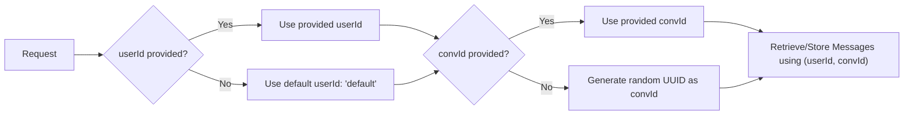

# Memory

Memory is a core component of VoltAgent agents, providing persistent storage for conversations. It enables agents to remember context across interactions, improving response quality and maintaining conversation continuity.

The `Agent` class interacts with memory through an internal `MemoryManager`. This manager uses a configured **Memory Provider** (like `LibSQLStorage` or `InMemoryStorage`) to handle the actual storage and retrieval of messages.

## Default Memory Configuration

By default, VoltAgent agents use **`LibSQLStorage`** for **zero-configuration local persistence**. This means you get conversational memory automatically without any setup:

```ts
const agent = new Agent({
  name: "My Assistant",
  llm: provider,
  model: "gpt-4-turbo",
  // No memory provider specified...
});
```

When you run this agent, the system automatically:

- Creates a `.voltagent` folder in your project root (if it doesn't exist).
- Creates and uses a SQLite database file at `.voltagent/memory.db` to store conversations.

This makes it easy to get started with stateful agents locally.

### Disabling Memory

You can completely disable memory by setting the `memory` property to `false`:

```ts
const agent = new Agent({
  name: "My Assistant",
  llm: provider,
  model: "gpt-4-turbo",
  memory: false, // Memory completely disabled
});
```

When memory is disabled, the agent won't store or retrieve any conversation history, making it stateless for each interaction.

### Customizing the Default Provider (`LibSQLStorage`)

To change the location of the local SQLite file:

```ts
import { LibSQLStorage } from "@voltagent/core";

// Use a custom file location
const memory = new LibSQLStorage({
  url: "file:./data/my-custom-memory.db",
});

const agent = new Agent({
  name: "My Assistant",
  llm: provider,
  model: "gpt-4-turbo",
  memory: memory,
});
```

### Using Turso with `LibSQLStorage` for Production

For scalable, persistent memory in production, configure `LibSQLStorage` to use a remote Turso database:

```ts
import { LibSQLStorage } from "@voltagent/core";

// Connect to a remote Turso database
const memory = new LibSQLStorage({
  url: process.env.TURSO_DATABASE_URL!, // e.g., "libsql://your-database.turso.io"
  authToken: process.env.TURSO_AUTH_TOKEN!,
  tablePrefix: "my_app", // Optional: Prefix for table names (e.g., "my_app_messages")
  storageLimit: 200, // Optional: Max messages per conversation (default: no limit)
  debug: false, // Optional: Enable debug logging (default: false)
});

const agent = new Agent({
  name: "My Assistant",
  llm: provider,
  model: "gpt-4-turbo",
  memory: memory,
});
```

### Using `InMemoryStorage` for Development/Testing

For development, testing, or scenarios where persistence isn't needed, `InMemoryStorage` keeps conversations only in the application's memory. Data is lost when the application restarts.

```ts
import { InMemoryStorage } from "@voltagent/core";

// In-memory storage (non-persistent)
const memory = new InMemoryStorage({
  storageLimit: 100, // Optional: Max messages per conversation (default: no limit)
  debug: true, // Optional: Enable verbose debug logging (default: false)
});

const agent = new Agent({
  name: "My Assistant",
  llm: provider,
  model: "gpt-4-turbo",
  memory: memory,
});
```

## User and Conversation Identification

To separate conversations for different users or different chat sessions, provide `userId` and `conversationId` in the options when calling agent methods:

```ts
const response = await agent.generateText("Hello, how can you help me?", {
  userId: "user-123", // Identifies the specific user
  conversationId: "conv-456", // Identifies this specific conversation thread
});
```

These identifiers work consistently across all agent generation methods (`generateText`, `streamText`, `generateObject`, `streamObject`).

```ts
// Example with streamText
// const stream = await agent.streamText("Stream a response please", {
//   userId: "user-123",
//   conversationId: "conv-456",
// });

// Example with generateObject
// const object = await agent.generateObject("Generate user details", userSchema, {
//   userId: "user-123",
//   conversationId: "conv-456",
// });
```

### How User and Conversation IDs Work



- **`userId`**: A unique string identifying the end-user. This ensures memory isolation between different users. If omitted, it defaults to the string `"default"`.
- **`conversationId`**: A unique string identifying a specific conversation thread for a user. This allows a single user to have multiple parallel conversations. If omitted, a **new random UUID is generated for each request**, effectively starting a new, separate conversation every time.

**Key Behaviors:**

1.  **Context Retrieval**: Before calling the LLM, the `MemoryManager` retrieves previous messages associated with the given `userId` and `conversationId` from the memory provider.
2.  **Message Storage**: After the interaction, new user input and agent responses are stored using the same `userId` and `conversationId`.
3.  **Continuity**: Providing the same `userId` and `conversationId` across multiple requests ensures the agent remembers the context of that specific thread.
4.  **New Conversations**: Omitting `conversationId` guarantees a fresh conversation context for each request (useful for one-off tasks or starting new chats).

```ts
// To start a NEW conversation each time (or for single-turn interactions):
// Omit conversationId; a new one is generated automatically.
// const response1 = await agent.generateText("Help with account", { userId: "user-123" });
// const response2 = await agent.generateText("Question about billing", { userId: "user-123" });

// To MAINTAIN a continuous conversation across requests:
// Always provide the SAME conversationId.
// const CONVERSATION_ID = "support-case-987";
// const responseA = await agent.generateText("Router issue", { userId: "user-456", conversationId: CONVERSATION_ID });
// const responseB = await agent.generateText("Still not working...", { userId: "user-456", conversationId: CONVERSATION_ID });
```

## Memory Providers

VoltAgent ships with two built-in memory providers:

### `InMemoryStorage`

- **Use Case:** Development, testing, demos, stateless applications.
- **Pros:** Zero setup, fast.
- **Cons:** Data is lost when the application stops.
- **Options:** `storageLimit` (max messages per conversation), `debug` (logging).

```ts
import { InMemoryStorage } from "@voltagent/core";
const memory = new InMemoryStorage({ storageLimit: 50, debug: true });
```

### `LibSQLStorage`

- **Use Case:** Production applications needing persistent memory.
- **Pros:** Persistent storage, scalable using local SQLite files or remote Turso databases.
- **Cons:** Requires file system access (for local files) or network access and credentials (for Turso).
- **Options:** `url`, `authToken` (for Turso), `tablePrefix`, `storageLimit`, `debug`.

```ts
import { LibSQLStorage } from "@voltagent/core";
// Local SQLite file (Default location: .voltagent/memory.db)
// const localMemory = new LibSQLStorage({ url: "file:./my-memory.db" });

// Remote Turso database
// const remoteMemory = new LibSQLStorage({
//   url: process.env.TURSO_DB_URL!,
//   authToken: process.env.TURSO_AUTH_TOKEN!,
//   tablePrefix: "prod_agent",
// });
```

## Context Management

When interacting with an agent that has memory enabled, the `MemoryManager` automatically retrieves recent messages for the given `userId` and `conversationId` and includes them as context in the prompt sent to the LLM.

```ts
// The agent automatically retrieves history for user-123/conv-456
// and includes up to 10 recent messages in the LLM prompt.
const response = await agent.generateText("What was the first thing I asked you?", {
  userId: "user-123",
  conversationId: "conv-456",
  contextLimit: 10, // Optional: Default usually handled by MemoryManager/Provider
});
```

The `contextLimit` parameter (passed in the options for methods like `generateText`) controls how many recent messages are fetched and included. This is crucial for:

1.  **Coherence**: Providing the LLM with enough history to understand the ongoing conversation.
2.  **Cost/Performance**: Limiting the context size to manage LLM token usage (cost) and potentially reduce latency.
3.  **Relevance**: Ensuring the context is relevant without overwhelming the LLM with excessive or old information.

## Implementing Custom Memory Providers

For specialized storage needs (e.g., using Redis, MongoDB, a different SQL database, or applying custom logic like summarization before storage), you can implement a custom memory provider.

Your custom class must implement the `Memory` interface defined in `@voltagent/core`. This typically involves providing implementations for methods like:

- `addMessages(messages: Message[], options: { userId: string; conversationId: string }): Promise<void>`: Stores new messages.
- `getMessages(options: { userId: string; conversationId: string; limit?: number }): Promise<Message[]>`: Retrieves messages for a conversation, respecting the optional limit.
- `clearConversation(options: { userId: string; conversationId: string }): Promise<void>`: Deletes all messages for a specific conversation.
- `clearUserHistory(options: { userId: string }): Promise<void>`: (Optional but recommended) Deletes all data for a specific user.
- `clearAllHistory(): Promise<void>`: (Optional but recommended) Deletes all stored memory data.

```ts
import type { Memory, Message } from "@voltagent/core";

// Example Structure
export class MyCustomRedisMemory implements Memory {
  private redisClient: any; // Your Redis client instance

  constructor(/* redis connection options */) {
    // Initialize Redis client
  }

  async addMessages(
    messages: Message[],
    options: { userId: string; conversationId: string }
  ): Promise<void> {
    const key = `memory:${options.userId}:${options.conversationId}`;
    // Logic to append messages to Redis list/stream, handling storageLimit if needed
  }

  async getMessages(options: {
    userId: string;
    conversationId: string;
    limit?: number;
  }): Promise<Message[]> {
    const key = `memory:${options.userId}:${options.conversationId}`;
    // Logic to retrieve messages from Redis, applying limit
    return []; // Return retrieved messages
  }

  async clearConversation(options: { userId: string; conversationId: string }): Promise<void> {
    const key = `memory:${options.userId}:${options.conversationId}`;
    // Logic to delete Redis key
  }

  // ... implement other methods as needed ...
}

// Use your custom memory provider
const agent = new Agent({
  // ... other options
  memory: new MyCustomRedisMemory(/* ... */),
});
```

## Best Practices

1.  **Choose the Right Provider**: Use `InMemoryStorage` for development, testing, or stateless needs. Use `LibSQLStorage` (local or Turso) or a custom provider for production persistence.
2.  **User Privacy**: Be mindful of storing conversation data. Implement clear data retention policies and provide mechanisms for users to manage or delete their history if required by privacy regulations (e.g., using `clearConversation` or `clearUserHistory` methods).
3.  **Context Management**: Tune the `contextLimit` based on your LLM's context window size, typical conversation length, and cost considerations.
4.  **Memory Efficiency**: For high-volume applications using persistent storage, monitor database size and consider setting appropriate `storageLimit` values on your memory provider to prevent unbounded growth.
5.  **Error Handling**: Wrap agent interactions in `try...catch` blocks, as memory operations (especially with external databases) can potentially fail.
