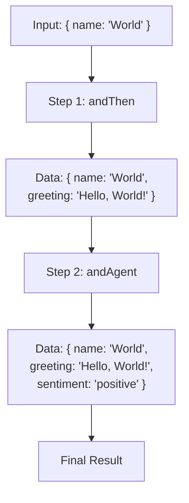

# Overview

> **Note: Workflows are in Preview**
> The Workflows API is currently in a preview state. This means it is stable and usable, but there may be breaking changes in future releases as we gather feedback and refine the developer experience.

> **Build powerful, type-safe AI workflows.** Go from a simple chain of functions to a complex, multi-step process that combines your code, AI models, and conditional logic with ease.

## What are Workflows?

A workflow is a chain of steps. Each step does something and passes its result to the next step.

```typescript
workflow = step1 → step2 → step3 → result
```

That's it. The power comes from what each step can do: run code, call AI, make decisions, run in parallel.

## Get Started in 2 Minutes

Let's build a workflow from scratch. We'll start with a simple function, add AI, and then introduce conditional logic. Each step will show the complete, runnable code.

### 1. Create a Basic Workflow

First, create a workflow that takes a name and returns a greeting. This is the simplest form of a workflow: a single step that processes some data.

```typescript
import { createWorkflowChain } from "@voltagent/core";
import { z } from "zod";

// Define the workflow's shape: its inputs and final output
const workflow = createWorkflowChain({
  id: "greeter",
  name: "Greeter Workflow",
  // A detailed description for VoltOps or team clarity
  purpose: "A simple workflow to generate a greeting for a given name.",
  input: z.object({ name: z.string() }),
  result: z.object({ greeting: z.string() }),
})
  // Add the first step: a function to create the greeting
  .andThen({
    id: "create-greeting",
    execute: async ({ data }) => {
      return { greeting: `Hello, ${data.name}!` };
    },
  });

// Run it!
const result = await workflow.run({ name: "World" });

console.log(result.result);
// Output: { greeting: 'Hello, World!' }
```

### 2. Add AI Intelligence

Now, let's enhance our workflow. We'll add an AI agent to analyze the sentiment of the greeting message. Notice how we add new imports, define an agent, and chain the `.andAgent()` step.

```typescript
import { createWorkflowChain, Agent } from "@voltagent/core";
import { z } from "zod";
import { openai } from "@ai-sdk/openai";

// Define an AI agent to use in our workflow
const agent = new Agent({
  name: "Analyzer",
  model: openai("gpt-4o-mini"),
  instructions: "You are a text analyzer.",
});

const workflow = createWorkflowChain({
  id: "greeter",
  name: "Greeter Workflow",
  input: z.object({ name: z.string() }),
  // The final result now includes the sentiment
  result: z.object({
    greeting: z.string(),
    sentiment: z.string(),
  }),
})
  .andThen({
    id: "create-greeting",
    execute: async ({ data }) => {
      return { greeting: `Hello, ${data.name}!` };
    },
  })
  // Add the new AI step to the chain
  .andAgent(({ data }) => `Analyze the sentiment of this greeting: "${data.greeting}"`, agent, {
    schema: z.object({ sentiment: z.string().describe("e.g., positive, neutral, negative") }),
  });

// Run the enhanced workflow
const result = await workflow.run({ name: "World" });

console.log(result.result);
// Output: { greeting: 'Hello, World!', sentiment: 'positive' }
```

### 3. Add Conditional Logic

Finally, let's add a step that only runs if a condition is met. We'll check if the input name is long and add a flag. The `.andWhen()` step is perfect for this. We also update the final `result` schema to include the new optional field.

```typescript
import { createWorkflowChain, Agent, andThen } from "@voltagent/core";
import { z } from "zod";
import { openai } from "@ai-sdk/openai";

const agent = new Agent({
  name: "Analyzer",
  model: openai("gpt-4o-mini"),
  instructions: "You are a text analyzer.",
});

const workflow = createWorkflowChain({
  id: "greeter",
  name: "Greeter Workflow",
  input: z.object({ name: z.string() }),
  // The final result now includes an optional 'isLongName' field
  result: z.object({
    greeting: z.string(),
    sentiment: z.string(),
    isLongName: z.boolean().optional(),
  }),
})
  .andThen({
    id: "create-greeting",
    execute: async ({ data }) => {
      return { greeting: `Hello, ${data.name}!` };
    },
  })
  .andAgent(({ data }) => `Analyze the sentiment of this greeting: "${data.greeting}"`, agent, {
    schema: z.object({ sentiment: z.string().describe("e.g., positive, neutral, negative") }),
  })
  // Add a conditional step
  .andWhen({
    id: "check-name-length",
    condition: ({ data }) => data.name.length > 10,
    step: andThen({
      id: "set-long-name-flag",
      execute: async ({ data }) => ({ ...data, isLongName: true }),
    }),
  });

// Run with a long name to trigger the conditional step
const longNameResult = await workflow.run({ name: "Alexanderson" });
console.log(longNameResult.result);
// Output: { greeting: 'Hello, Alexanderson!', sentiment: 'positive', isLongName: true }

// Run with a short name to skip the conditional step
const shortNameResult = await workflow.run({ name: "Alex" });
console.log(shortNameResult.result);
// Output: { greeting: 'Hello, Alex!', sentiment: 'positive' }
```

## How It Works

Workflows are built on three core principles:

### 1. A Chain of Steps

You build a workflow by chaining steps together using methods like `.andThen()`, `.andAgent()`, and `.andWhen()`. Each step performs a specific action, like running code, calling an AI, or making a decision.

```typescript
createWorkflowChain(...)
  .andThen(...) // Step 1: Run some code
  .andAgent(...) // Step 2: Call an AI
  .andWhen(...)  // Step 3: Maybe run another step
```

### 2. Data Flows Through the Chain

The output of one step becomes the input for the next. The data object is automatically merged, so you can access results from all previous steps.



### 3. Automatic Type Safety

As data flows through the workflow, TypeScript types are automatically inferred and updated at each step. This means you get full autocompletion and type-checking, preventing common errors.

```typescript
import { z } from "zod";
import { Agent, createWorkflowChain } from "@voltagent/core";

declare const agent: Agent<any>;

createWorkflowChain({
  id: "type-safe-workflow",
  name: "Type-Safe Workflow",
  input: z.object({ email: z.string() }),
  result: z.object({ success: z.boolean() }),
})
  // `data` is typed as { email: string }
  .andThen({
    id: "add-user-id",
    execute: async ({ data }) => {
      // data.email is available and type-safe
      return { ...data, userId: "user-123" };
    },
  })
  // `data` is now typed as { email: string, userId: string }
  .andAgent(
    ({ data }) => `Welcome ${data.userId}`, // data.userId is available!
    agent,
    {
      schema: z.object({ welcomeMessage: z.string() }),
    }
  )
  // `data` is now typed as { ..., welcomeMessage: string }
  .andThen({
    id: "finalize",
    execute: async ({ data }) => {
      // data.welcomeMessage is available!
      return { success: true };
    },
  });
```

## Builder vs. Runnable: `toWorkflow()`

When you use `createWorkflowChain`, you are creating a **builder** object (`WorkflowChain`). Each call to `.andThen()`, `.andAgent()`, etc., modifies this builder and returns it, allowing you to chain methods.

This builder is not the final, runnable workflow itself. It's the blueprint.

There are two ways to run your workflow:

**1. The Shortcut: `.run()`**

Calling `.run()` directly on the chain is a convenient shortcut. Behind the scenes, it first converts your chain into a runnable workflow and then immediately executes it. This is great for most use cases.

```typescript
// .run() builds and executes in one step
const result = await workflow.run({ name: "World" });
```

**2. The Reusable Way: `.toWorkflow()`**

The `WorkflowChain` builder has a `.toWorkflow()` method that converts your blueprint into a permanent, reusable `Workflow` object. You can store this object, pass it to other functions, or run it multiple times without rebuilding the chain.

This is powerful for creating modular and testable code.

```typescript
import { createWorkflowChain } from "@voltagent/core";
import { z } from "zod";

// 1. Define the chain (the builder)
const greeterChain = createWorkflowChain({
  id: "reusable-greeter",
  name: "Reusable Greeter",
  input: z.object({ name: z.string() }),
  result: z.object({ greeting: z.string() }),
}).andThen({
  id: "create-greeting",
  execute: async ({ name }) => ({ greeting: `Hello, ${name}!` }),
});

// 2. Convert the builder into a runnable, reusable workflow object
const runnableGreeter = greeterChain.toWorkflow();

// 3. Now you can run it as many times as you want
const result1 = await runnableGreeter.run({ name: "Alice" });
console.log(result1.result); // { greeting: 'Hello, Alice!' }

const result2 = await runnableGreeter.run({ name: "Bob" });
console.log(result2.result); // { greeting: 'Hello, Bob!' }
```

This distinction allows you to define your workflow logic once and execute it in different contexts or at different times.

### Accessing Execution State

You can pass run-specific data to your workflow, such as a user ID or other contextual information. This state is available in every step, allowing you to build dynamic, user-aware workflows.

**1. Pass State During `.run()`**

Provide the initial state in the second argument of the `.run()` method.

```typescript
const result = await workflow.run(
  { name: "State" },
  {
    userId: "user-abc-123",
    conversationId: "conv-xyz-456",
    context: new Map([["plan", "premium"]]),
  }
);
```

**2. Access and Modify State in Steps**

The `execute` function can accept a second argument containing the execution state. You can also modify the `context` map, and the changes will be available in subsequent steps.

```typescript
import { createWorkflowChain } from "@voltagent/core";
import { z } from "zod";

const workflow = createWorkflowChain({
  id: "state-demo",
  name: "State Demo",
  input: z.object({ name: z.string() }),
  result: z.object({ greeting: z.string(), permissions: z.string() }),
})
  .andThen({
    id: "check-initial-plan",
    execute: async (data, state) => {
      const userId = state.userId;
      const plan = state.context.get("plan");

      console.log(`Step 1: User ${userId} is on the ${plan} plan.`);

      // Modify context for subsequent steps
      if (plan === "premium") {
        state.context.set("permissions", "unlimited");
        console.log(`Step 1: Granted 'unlimited' permissions.`);
      }

      return data; // Pass the original data through
    },
  })
  .andThen({
    id: "use-modified-state",
    execute: async (data, state) => {
      const permissions = state.context.get("permissions");
      console.log(`Step 2: User now has '${permissions}' permissions.`);

      // Return the final result
      return {
        greeting: `Hello, ${data.name}!`,
        permissions: permissions as string,
      };
    },
  });

// Run it with an initial state
await workflow.run(
  { name: "Alex" },
  {
    userId: "user-alex-789",
    context: new Map([["plan", "premium"]]),
  }
);

// Console Output:
// Step 1: User user-alex-789 is on the premium plan.
// Step 1: Granted 'unlimited' permissions.
// Step 2: User now has 'unlimited' permissions.
```

### Using State with AI Agents

The execution state is particularly powerful when used with `andAgent`. VoltAgent automatically uses the `userId` and `conversationId` from the state to scope the agent's memory.

This allows the agent to maintain a persistent, contextual conversation with each user, remembering past interactions within the same conversation without any extra configuration.

```typescript
// ... inside a workflow chain
.andAgent(
  (data) => `Based on our previous discussion, what should we do next?`,
  agent,
  {
    schema: z.object({ nextStep: z.string() }),
  }
)
// The `userId` and `conversationId` from the run state are automatically
// used by the agent's memory to provide context-aware responses.
```

### Workflow History & Observability


One of the most powerful features of VoltAgent is its built-in observability layer. Every workflow automatically records its execution history, a detailed trace of every step, its inputs, outputs, status, and timing. This history is crucial for debugging and can be visualized in real-time using the [**VoltOps Console**](https://console.voltagent.dev/).

This execution history is stored using a **memory provider**. By default, VoltAgent uses `InMemoryStorage` for in-memory storage during development.

The `memory` property in the `createWorkflowChain` configuration allows you to **override this default storage mechanism**. This is useful when moving to production or if you want persistent storage.

You can use several providers to store workflow history:

- **Built-in Provider** (from `@voltagent/core`):
  - `InMemoryStorage`: The default provider, a non-persistent store ideal for development and stateless deployments.
- **External Packages**:
  - `@voltagent/libsql`: Provides `LibSQLMemoryAdapter` for file-based SQLite/Turso-backed storage via the unified `Memory` API.
  - `@voltagent/postgres`: Provides `PostgreSQLMemoryAdapter` for production environments.
  - `@voltagent/supabase`: Provides `SupabaseMemoryAdapter` for Supabase integration.

```typescript
import { createWorkflowChain } from "@voltagent/core";
import { z } from "zod";
import { PostgresStorage } from "@voltagent/postgres";

// Example of overriding the default history storage for production
const workflow = createWorkflowChain({
  id: "production-workflow",
  name: "Production Workflow",
  input: z.object({ id: z.string() }),
  result: z.object({ success: z.boolean() }),
  // Store workflow run history in a PostgreSQL database
  memory: new PostgresStorage({ connectionString: process.env.DATABASE_URL }),
}).andThen(/*... your steps ...*/);
```

> **Important Distinction:** The workflow's `memory` property is for storing **execution history** (the trace of the run). It is separate from an **Agent's conversational memory**, which is configured on the Agent instance itself and allows it to remember past conversations.

### Registering Workflows for Observability

Storing a workflow's history is the first step. To make that history visible in an observability tool like **VoltOps**, you need to register your workflow with a central `VoltAgent` instance.

This is typically done in your application's main entry point. By passing your workflow objects to the `workflows` property of the `VoltAgent` constructor, you make them discoverable. Once registered, you can:

1.  Run your local application.
2.  Open the [**VoltOps Console**](https://console.voltagent.dev/).
3.  Find your workflow listed by its name (e.g., "my-workflow").
4.  Click on it to see a detailed, visual trace of every run.

```typescript
import { VoltAgent, createWorkflowChain } from "@voltagent/core";
// ... other imports
// ... (define myWorkflow and anotherWorkflow using createWorkflowChain)

// 3. Register them with the VoltAgent instance
new VoltAgent({
  agents: { myAgent },
  workflows: {
    myWorkflow,
    anotherWorkflow,
  },
});

// After running the workflows, their execution traces will be visible in your VoltOps dashboard.
```

This registration step is what connects your locally executed workflows to the broader observability layer, allowing you to monitor, debug, and manage them from a central location.

### Executing Workflows via REST API

Once your workflows are registered with VoltAgent, they can also be executed through the REST API. This is useful for triggering workflows from web applications, mobile apps, or any external system.

**Execute Workflow Endpoint:** `POST /workflows/{id}/execute`

```bash
curl -X POST http://localhost:3141/workflows/my-workflow/execute \
     -H "Content-Type: application/json" \
     -d '{
       "input": {
         "email": "user@example.com",
         "name": "John Doe"
       },
       "options": {
         "userId": "user-123",
         "conversationId": "conv-456"
       }
     }'
```

**Response:**

```json
{
  "success": true,
  "data": {
    "executionId": "exec_1234567890_abc123",
    "startAt": "2024-01-15T10:00:00.000Z",
    "endAt": "2024-01-15T10:00:05.123Z",
    "status": "completed",
    "result": {
      "userId": "usr_generated_123",
      "welcome": "Welcome John!"
    }
  }
}
```

The workflow can also suspend during execution and be resumed later. For detailed information about suspending and resuming workflows via REST API, see the [Suspend & Resume documentation](./suspend-resume.md#rest-api-usage).

## Workflow Hooks

Workflows provide hooks that allow you to tap into the lifecycle of a workflow run. You can execute custom logic at key points, such as before and after a step or at the beginning and end of the entire workflow. This is useful for logging, metrics, or any other side effects you want to perform.

| Hook          | Trigger                                         |
| ------------- | ----------------------------------------------- |
| `onStart`     | Before the workflow begins execution.           |
| `onEnd`       | After the workflow finishes (success or error). |
| `onStepStart` | Before each individual step starts.             |
| `onStepEnd`   | After each individual step completes.           |

For more details, see the [Workflow Hooks](./hooks.md) documentation.

## Core Step Types

| Step           | Purpose                            | Example Use Case                     |
| -------------- | ---------------------------------- | ------------------------------------ |
| **`andThen`**  | Execute any TypeScript function    | Data processing, API calls           |
| **`andAgent`** | Run an AI agent                    | Text analysis, content generation    |
| **`andWhen`**  | Execute a step conditionally       | Branching logic based on data        |
| **`andAll`**   | Run steps in parallel (wait all)   | Batch processing, multiple API calls |
| **`andRace`**  | Run steps in parallel (first wins) | Fallbacks, cache vs. API race        |

## Workflow Schemas

Workflows can validate data at key points using schemas:

```typescript
const workflow = createWorkflowChain({
  id: "user-onboarding",
  name: "User Onboarding",
  // Validates initial input
  input: z.object({ email: z.string().email() }),
  // Validates final result
  result: z.object({ userId: z.string(), welcome: z.string() }),
  // Validates data when workflow suspends
  suspendSchema: z.object({ waitingFor: z.string() }),
  // Validates data when workflow resumes
  resumeSchema: z.object({ approved: z.boolean() }),
});
```

Each step can also have its own schemas that override the workflow defaults. This ensures type safety throughout your workflow.

## Next Steps

1.  **Explore the Step Types**: Dive deeper into each step, starting with [`andThen`](./steps/and-then.md).
2.  **Learn about Hooks**: Understand how to use [Workflow Hooks](./hooks.md) to add custom logic to your workflows.
3.  **Check out Example**: See [with-workflow](https://github.com/VoltAgent/voltagent/tree/main/examples/with-workflow) example.
4.  **REST API Integration**: Learn how to [execute, suspend, and resume workflows via REST API](../api/overview.md#workflow-endpoints).
