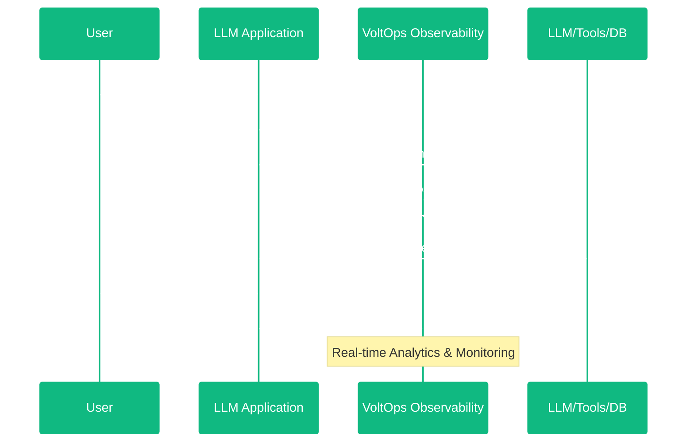

In VoltOps, a trace is a record of the entire process from a user's request to the system's response. Each trace captures all steps, decisions, and data flow from the beginning to the end of a single user interaction.

:::tip Solves the black-box problem
Traces eliminate the "black box" nature of AI applications by providing complete transparency and enabling you to manage your systems with confidence.
:::

VoltOps provides **n8n-style observability** with a visual canvas interface that makes complex AI workflows intuitive to understand.

:::note The n8n-inspired canvas visualization offers several key advantages

- **Visual Workflow Mapping**: See your entire AI workflow as connected nodes, making it easy to understand data flow and decision points
- **Intuitive Debugging**: Quickly identify where issues occur by visually following the execution path through your AI agents and tools
- **Non-Technical Accessibility**: Enable stakeholders without deep technical knowledge to understand and analyze AI system behavior
- **Real-time Monitoring**: Watch your AI workflows execute in real-time with live status updates on the visual canvas
- **Simplified Complexity**: Transform complex, multi-step AI processes into clear, digestible visual representations
  :::

## Core Trace Features

 

 

**Unique Session Identity:**
Each trace is identified with a unique session ID and maintains complete context throughout the interaction lifecycle.

**Flexible Organization:**
Traces support tagging and metadata for easy categorization and filtering across your AI workflows.

**Real-time Visibility:**
VoltOps captures and visualizes traces in real-time, enabling instant monitoring and issue detection.

**Hierarchical Structure:**
Agents, tools, memory operations, and retrievers are organized in meaningful hierarchies that reflect your AI application's logic.

**Complete Lifecycle Tracking:**
From start to finish, traces monitor status changes, performance metrics, and outcomes.

 **Information Captured in Traces**

### Session and Context Data

- **User Identity**: User ID, profile information, and preferences
- **Conversation Context**: Conversation ID, history references, and session state
- **Input/Output Flow**: Original requests, system responses, and data transformations
- **Custom Metadata**: Priority levels, source channels, departments, and domain-specific information

### Performance and Cost Metrics

- **Token Usage**: Prompt tokens, completion tokens, and total consumption
- **Timing Data**: Processing times, response latency, and execution duration
- **Cost Analysis**: API call costs and resource consumption

### Error and Status Information

- **Status Tracking**: Running, completed, or error states with timestamps
- **Error Details**: Messages, codes, and failure stages
- **Success Metrics**: Completion rates, confidence scores, and quality indicators
- **Audit Trail**: Decision points and state transitions

## VoltOps vs General Observability Concepts

VoltOps tracing builds upon established observability concepts but adapts them specifically for AI agent workflows. Understanding how VoltOps concepts map to general observability terms helps you leverage existing knowledge while working with AI-native structures.

### Concept Mapping

**VoltOps Trace ≡ General Trace**
Both represent a complete user interaction session from request to response, maintaining unique identifiers, timestamps, and hierarchical organization.

**VoltOps Agent ≈ Event + Trace**
An agent functions as both a span (tracking execution and hierarchy) and a generation (capturing AI model interactions with parameters, token usage, and responses).

**VoltOps Tools/Memory/Retrievers ≈ Events**
These operations behave like traditional spans, tracking execution time, success/error states, input/output data, and nested hierarchies.

**VoltOps Success/Error Events ≈ Discrete Events**
Status changes function as timestamped events marking state transitions and providing audit trails.
